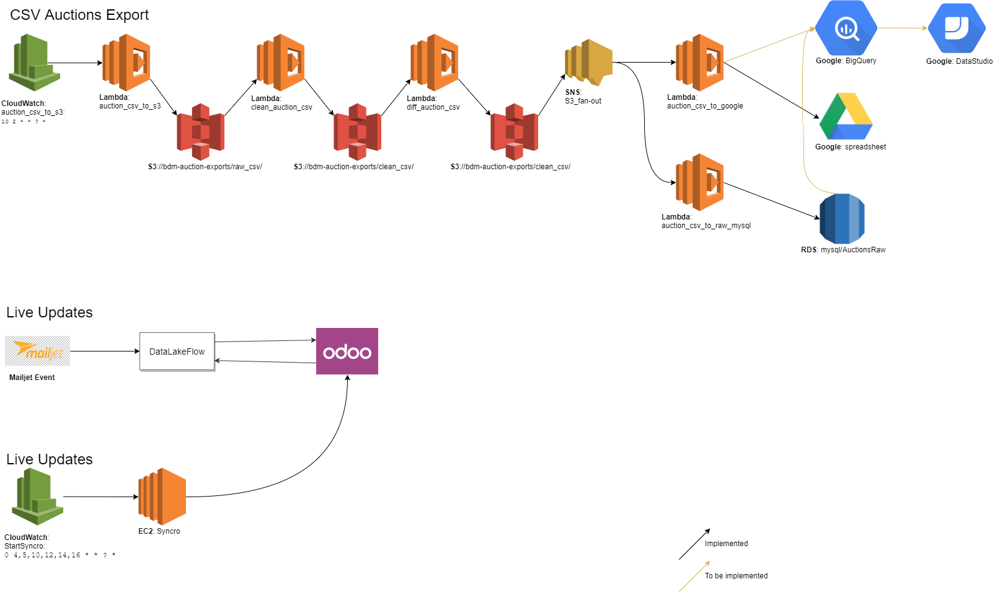

# AWS λ-functions

Together, these functions perform variuos bussiness process automation tasks.
Various functions and how they work together are depicted in the flowchart
below:

## Functions

### auction_csv_to_google

AWS λ-function to:

 - get's two files from S3 (triggered by SNS-topic):
     - s3://bdm-auction-exports/clean_csv/latest.csv
     - s3://bdm-auction-exports/clean_csv/diff.csv
 - uploads them to Google Drive as spreadsheets

 That's all...

### auction_csv_to_raw_mysql

This AWS λ-function:

  - downloads /clean_csv/diff.csv from s3://bdm-auction-export
  - adds (via REPLACE) these records to `AuctionsRaw`-table on
    MySQL RDS
  - is triggered by the arrival of the diff.csv file on S3
    (via SNS fan-out)

 That's all...

### auction_csv_to_s3

AWS λ-function to:

 - download the csv-auction export from:
     <auction_export_url> (environment variable)
 - perform some basic checks: catch potential errors early...
 - ship it to s3://bdm-auction-exports/raw_csv/yyyy/mm/...

This function is cron-triggered via CloudWatch rules

$ source env.secrets

before starting.

That's all...

### bdm_event_catcher

### bdm_event_lead_trigger

- is triggered by the arrival of a JSON lead on S3
    (s3://bdm-events/leads/)
    (which in itself was triggered by the campaign_entries λ-function)
- reads in information from the JSON file and (based on config from
    DDB):
    - adds to RDS (MySQL: Contacts, ContactsCampaigns)
    - adds to Mailjet, if needed
    - can add campaign to Campaigns (MySQL) if it doesn't exist

That's all...

### clean_auction_csv

AWS λ-function to:

 - get/read today's raw csv from S3
 - clean it:
     - format fields (datetime to UTC, strip away chars in OGM, ...)
     - find and remove bad lines (send out warning)
     - mark suspicious bids
 - filter it:
     - remove rows from own domains and emails
 - save to S3 on /clean_csv (which will trigger the diff-fn):
     - rename clean_csv/latest.csv -> clean_csv/yesterday.csv
     - upload new to clean_csv/latest.csv

That's all...

### csv_load_contacts

### diff_auction_csv

### get_item_from_biedmee

### mj_to_s3

### odoo_loader3
